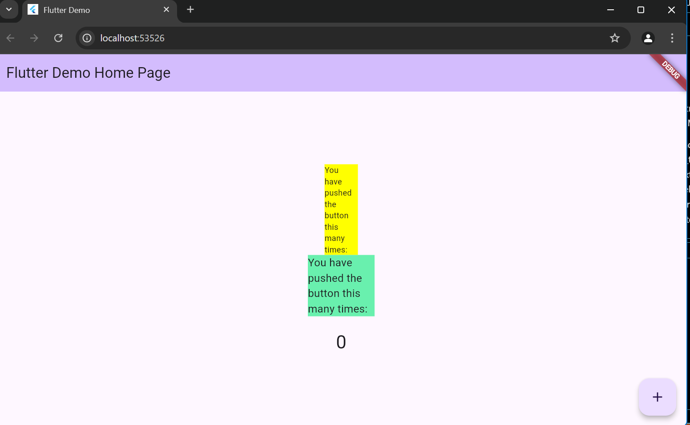
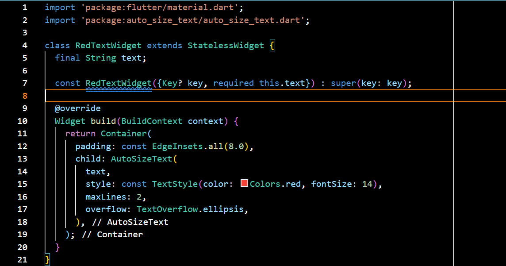

# Tugas
1. Selesaikan Praktikum tersebut, lalu dokumentasikan dan push ke repository Anda berupa screenshot hasil pekerjaan beserta penjelasannya di file README.md
   - hasil main.dart
        
   - red_text_widget.dart
        

2. Jelaskan maksud dari langkah 2 pada praktikum tersebut!
    Perintah flutter pub add auto_size_text digunakan untuk menambahkan paket auto_size_text ke dalam proyek Flutter. Paket ini memungkinkan teks untuk secara otomatis menyesuaikan ukuran fontnya agar sesuai dengan ruang yang tersedia, sehingga tidak ada teks yang terpotong. 

3. Jelaskan maksud dari langkah 5 pada praktikum tersebut!
   - final String text;: Mendeklarasikan variabel text yang bertipe String sebagai properti dari widget RedTextWidget. final berarti nilai dari text hanya dapat diatur satu kali.
   - const RedTextWidget({Key? key, required this.text}): Merupakan konstruktor untuk RedTextWidget.
     - Key? key: Parameter opsional yang digunakan untuk memberikan identitas unik pada widget dalam tree widget.
     - required this.text: Parameter wajib yang harus diberikan saat membuat instance dari RedTextWidget, memastikan bahwa text selalu terisi.
     
4. Pada langkah 6 terdapat dua widget yang ditambahkan, jelaskan fungsi dan perbedaannya!
    - Container pertama (warna kuning):
      - Fungsi: Menggunakan widget kustom RedTextWidget untuk menampilkan teks. Widget ini mungkin memiliki gaya atau perilaku khusus yang didefinisikan dalam implementasi RedTextWidget.
      - Perbedaan: Karena ini adalah widget kustom, perilakunya dapat berbeda, misalnya mungkin memiliki warna teks merah atau menyesuaikan ukuran teks berdasarkan ruang yang tersedia.
    - Container kedua (warna hijau):
      - Fungsi: Menggunakan widget bawaan Text untuk menampilkan teks biasa tanpa perilaku kustom.
      - Perbedaan: Ini adalah widget standar yang tidak memiliki fitur tambahan dari RedTextWidget, sehingga akan menampilkan teks dalam gaya default.

5. Jelaskan maksud dari tiap parameter yang ada di dalam plugin auto_size_text berdasarkan tautan pada dokumentasi ini !
   - key*: Mengontrol cara satu widget menggantikan widget lain dalam tree.
   - textKey: Menetapkan kunci untuk widget Text yang dihasilkan.
   - style*	: Jika tidak null, gaya yang digunakan untuk teks ini.
   - minFontSize: Batasan ukuran teks minimum saat menyesuaikan ukuran teks. Diabaikan jika presetFontSizes diset.
   - maxFontSize: Batasan ukuran teks maksimum saat menyesuaikan ukuran teks. Diabaikan jika presetFontSizes diset.
   - stepGranularity: Ukuran langkah di mana ukuran font disesuaikan dengan batasan.
   - presetFontSizes: Menetapkan semua ukuran font yang mungkin. Penting: harus dalam urutan menurun.
   - group: Menyinkronkan ukuran dari beberapa AutoSizeText.
   - textAlign*	: Bagaimana teks harus disejajarkan secara horizontal.
   - textDirection*: Arah teks, menentukan bagaimana nilai textAlign diinterpretasikan
   - locale*: Digunakan untuk memilih font ketika karakter Unicode yang sama dapat dirender berbeda, tergantung pada locale.
   - softWrap*: Apakah teks harus terputus pada garis putus.
   - wrapWords: Apakah kata-kata yang tidak muat dalam satu baris harus dibungkus. Default adalah true untuk berperilaku seperti Text.
   - overflow*: Bagaimana visual overflow harus ditangani.
   - overflowReplacement: Jika teks meluap dan tidak muat dalam batasnya, widget ini ditampilkan sebagai gantinya.
   - textScaleFactor*: Jumlah pixel font untuk setiap pixel logis. Juga mempengaruh minFontSize, maxFontSize, dan presetFontSizes
   - maxLines: Jumlah maksimum baris yang opsional untuk teks.
   - semanticsLabel*: Label semantik alternatif untuk teks ini.

6. Kumpulkan laporan praktikum Anda berupa link repository GitHub kepada dosen!
